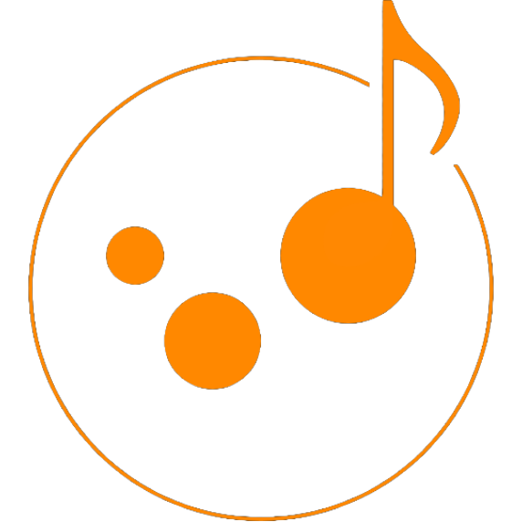

# JamBubble-DayOff

「車内でひとつのプレイリストを、"みんなで奏でる" 体験」を提供するシステム&amp;アプリケーション

**主な技術スタック**

  <!-- フレームワーク・プラットフォーム -->
    
  
  

  
  

  

## 🚀 プロジェクト概要

**JamBubble**は、友達やサークル仲間とのドライブや、宅飲み、ホームパーティーなど、少人数での音楽体験をより楽しく、共有できるようにするためのアプリです。通常、車の Bluetooth スピーカーに接続できる端末は一台だけなので、音楽の選曲はその端末の所有者に偏りがちです。結果として、同乗者はただ受動的に音楽を聴くだけになり、みんなで一緒に場を作る体験が十分に得られません。

JamBubble では、スピーカーに接続しているホスト端末から QR コードやリンクを発行し、ゲストはログイン不要でブラウザからそのリンクにアクセスするだけで、自分の聴きたい曲をプレイリストにリクエストできます。リクエストされた曲は順番に再生され、全員が主体的に音楽に参加できる仕組みになっています。また、アプリを持っているユーザー同士であれば、離れた場所でも同じプレイリストを作成・再生できるため、一人で勉強や作業をしながらも、他の人と音楽を共有することが可能です。

このアプリによって、音楽の選曲権が一部の人に偏ることなく、全員が参加してその場の空気を作り出せる体験が提供されます。QR コードひとつで簡単に参加できる手軽さや、セキュリティを担保する時限リンクやワンタイムパスワード認証などの工夫により、手軽さと安全性を両立しています。JamBubble は、ただ音楽を流すだけでなく、「みんなで一緒に作る音楽体験」を可能にする新しいプラットフォームです。
